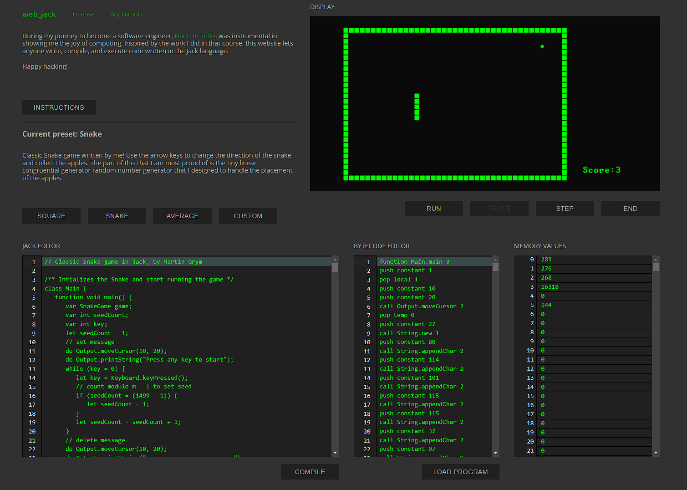

# [web_jack](https://web-jack-svelte.vercel.app/)

## Overview

Welcome to web_jack - a web based compiler and runtime for the Jack langauge from Nand to Tetris. Web_Jack combines a Svelte frontend with a compiler written in Python and a runtime implemented in Rust and compiled to WebAssembly. After finishing the Nand to Tetris book I wanted to try my hand at learning Rust and web development, and implementing a Jack virtual machine seemed like a great way to demonstrate what I learned and learn some more along the way. 



## Features

- **Svelte Frontend**
- **Jack Compiler in Python:** The Python-based compiler parses and translates Jack source code into bytecode, ready for execution on the virtual machine.
- **Runtime Environment and Virtual Machine in Rust:** The Rust-based runtime executes the compiled bytecode efficiently within a WebAssembly environment, ensuring optimal performance.
- **Integration:** The frontend communicates with the runtime via bindings to the canvas and the underlying memory array.

## How to Run Locally

**Clone the repository** 

```
git clone https://github.com/gray-lab/WEB-JACK-SVELTE.git
```

**Install NPM packages** 
```
npm --install
```

**Run local develoment server**
```
npm run dev
```
    
## Implementation Details

### Compiler
The compiler translates high-level Jack code to an intermediate stack machine bytecode representation. The Jack language is relatively simple and offers basic features, e.g. arithmetic and logical operations, conditional branching and looping, function calls, as well as somewhat more complex features like classes, objects and method calls. 

The compiler is written in Python and invoked via the Pyodide Python runtime. It consists of a tokenizer, which parses the Jack code into a token generator, and a recursive descent compiler that builds the bytecode representation by iterating through the token from the beginning to the end, a top-down approach. Symbols are tracked on a class and function level via symbol tables. The Jack grammar is designed such that a single token lookahead is sufficient to compile the language, with only a few exceptions requiring a two token lookahead. This technically makes it a LL(2) grammar, but for the majority of the rules it is LL(1).

A full discussion of the Jack language can be found in Chapter 9 of Nand to Tetris. Note that in the original specification each class exists in its own file. My implementation is modified to simplify editing code in the browser, and all classes in a program can live in the editor at one time.

### Standard Library
A language alone is often not very useful, and that is also the case for Jack. Therefore, Jack is supported by a standard function library that includes various common operations on integers, strings, display functions, memory allocation, and others. Most of this library was implemented in the Rust virtual machine as a function call table, with the exception of the input functions, which are implemented in Jack. In the original specification, Output and Screen functions directly changed the memory array that underlay the display, but in this implementation, those functions invoke html canvas methods to directly draw elements on the display. To maintain the spirit of the original, characters are drawn using pixel bitmaps, as bit banging is fun! 

A PDF document of the standard library is available [here](https://www.nand2tetris.org/_files/ugd/44046b_a89c06efcef3491cafb42fb76cc95dc0.pdf) (from Nand to Tetris).

### Runtime
In the full Nand 2 Tetris architecture (termed the HACK computer), the virtual machine provides an abstraction on top of the HACK processor to serve as an intermediate stage between the high-level language and the 16 bit machine instructions that are executed on the CPU. In my implementation, the runtime directly executes the VM bytecode to manipulate the memory array and thus emulate the CPU operations. The VM is a stack machine which supports push, pop, basic arithmetic-logical, conditional branching and function call operations (A detailed description can be found in Chapter 7 & 8 of Nand to Tetris):

| Memory Manipulation |
| --- |
| pop *segment index*
| push *segment index* |

| Arithmetic-Logical |
| --- |
| add  |
| sub |
| neg |
| eq |
| gt |
| lt |
| and |
| or |
| not |

| Branching |
| --- |
| label *label* |
| goto *label* |
| if-goto *label* |

| Function Calls |
| --- |
| function *fn_name n_vars* |
| call *fn_name n_args* |
| return |

The VM (and the HACK hardware) supports a total program memory of 16,384 (0x4000) 16bit words, divided into 16 virtual registers, a global stack, and a heap.

| Memory Mapping |
| --- |
| 0-15: Virtual Registers | 
| >256: Global Stack
| <16383: Heap |

The virtual registers are used to hold various stack and segment pointers as well as intermediate values before operations. These virtual registers are not the same as the physical CPU registers, which only exist one level lower, at the machine/assembly instruction level. 

| Registers |
| --- | 
| 0: Stack Pointer |
| 1: Local Segment Pointer |
| 2: Argument Segment Pointer |
| 3: This Segment Pointer |
| 4: That Segment Pointer |
| 5-12: Temporary Value Registers |
| 13-15: Internal Use Registers |

### Frontend
The web interface is built using Svelte with the Sveltekit framework. Sveltekit was chosen over React because it is a more lightweight compiled framework and it is easier to integrate with WebAssembly. The WebAssembly virtual machine is initialized when a bytecode program is loaded, with the canvas passed in to let the virtual machine bind to it. Memory values are accessed for display by instantiating a Int16Array that references the underlying runtime memory. The code editors use CodeMirror instances with Svelte stores to maintain state.


## Known Issues & Future Work
- Improve the allocator so that it can combine and reuse fragmented memory segments
- Add stack and heap overflow handling (currently they will just run into one another, unleashing chaos)
- Add highlighting of current bytecode instruction, and more detailed information about internal execution state


## Contributing

I welcome contributions to enhance this project! If you have ideas, improvements, or bug fixes, feel free to create a pull request. 

## Acknowledgments

I would like to express my gratitude to the creators of the [Nand to Tetris](https://www.nand2tetris.org/) course for inspiring this project, as well as the Svelte, Python, and Rust communities for providing the tools and resources necessary to bring this idea to life. I also want to thank all the awesome people at Recurse Center who encouraged and supported me while building this project as well as provided invaluable feedback.

## License

This work uses some elements from [Nand to Tetris](https://www.nand2tetris.org/) by Noam Nisan and Shimon Schocken, including the Jack language grammar, bytecode grammar, and standard library specifications, the Square Game code, and the Average Program code.
All materials and elements in this website are licensed under a [Creative Commons Attribution-NonCommercial-ShareAlike 3.0 Unported License](https://creativecommons.org/licenses/by-nc-sa/3.0/).
	

